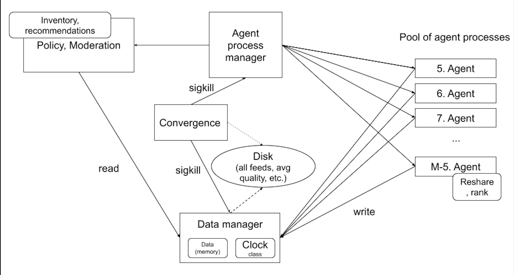
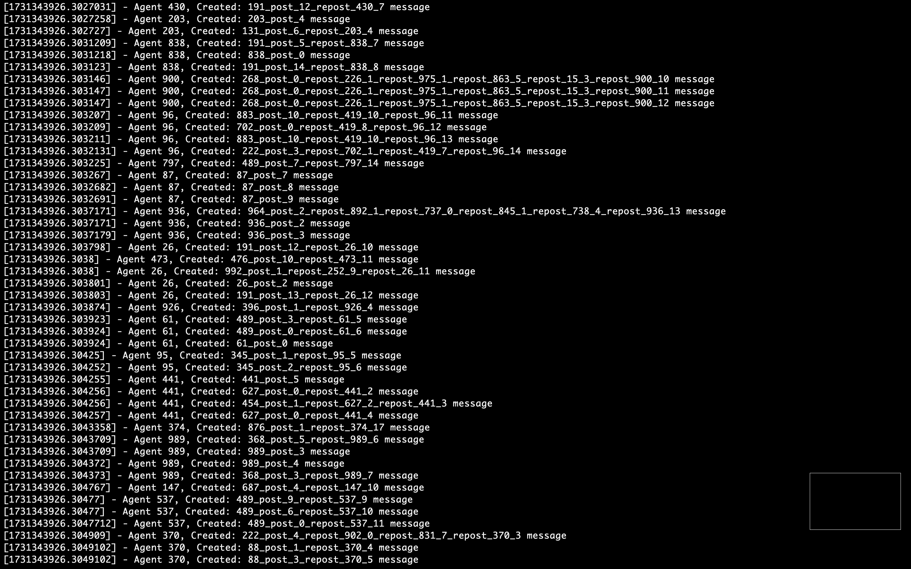
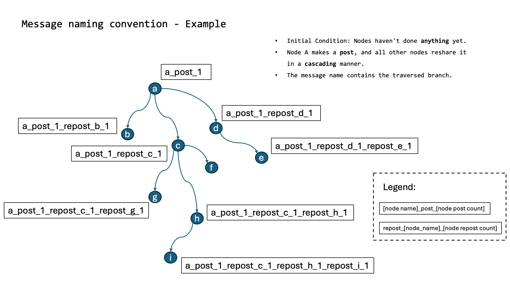

# SimSoM - Parallel Implementation

This module defines a basic schema for the parallel implementation of SimSoM, originally developed by Bao Tran Truong <3 from Indiana University.

## Overview

The definitions of the `Agent` and `Message` classes are kept to a minimum to facilitate code testing. However, please note that many features are still missing, such as:

- Messages produced are not saved to disk
- There is no convergence checking
- Logger removed due to more than one process
- No timestamp clock

The current code focuses on implementing the agent pool manager and the mechanism for scheduling agents to each agent handler process when available.

## Batched Agent Processing

To improve efficiency, this implementation processes agents in batches. The batch size can be configured to optimize performance based on the specific hardware and workload.

## Architecture

The logical target architecture of the system is illustrated in the following diagram:



## Example Output

The following screenshot shows an example output, displaying a number of generated messages:



## Message Naming Convention

The names of the generated messages follow a specific convention, representing the traversed branches:



## Planned Improvements

The current implementation has very basic definitions for the `Message` and `Agent` classes. However, the previous development version included more complex versions of these classes that need to be ported over.

- Porting of previoud `Message` and `Agent` (`User`) classes
- Add configuration settings to command line (now are hardcoded)
- Convergence process logic implementation
- Persistent storage of generated messages to disk
- Timestamp-based message ordering and clock management
- Discuss about how to implement a logger

## Usage

To start the simulation, use the following command:

```
mpiexec -n 8 python simsom.py
```

This will run the simulation using 8 processes.

## Known Limitations

- **Missing Features**: As mentioned in the docstring, many features are still missing, such as message persistence, convergence checking, and timestamp clock.
- **Experimental Code**: This implementation is still in an experimental stage and should be used with caution.

## Contact

For any questions (except the meaning of life), please contact the following people:

- Bao Tran Truong: `baotruon@iu.edu`
- Gianluca Nogara: `gianluca.nogara@supsi.ch`
- Enrico Verdolotti: `enrico.verdolotti@supsi.ch`

## Motto

*Festina lente.*